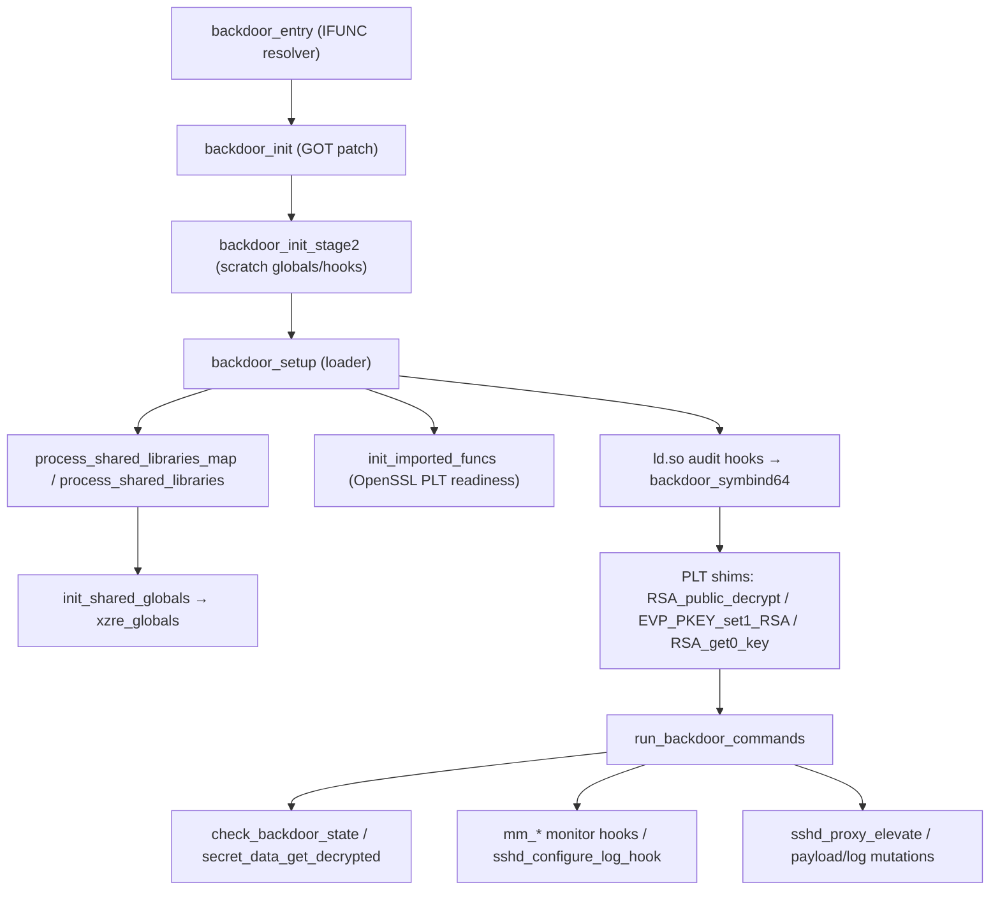
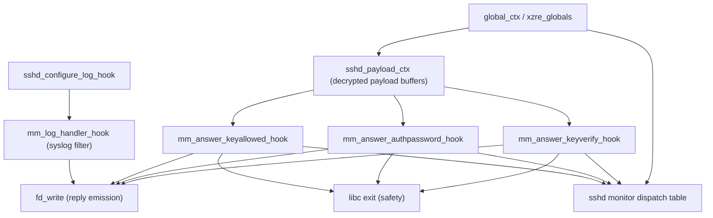
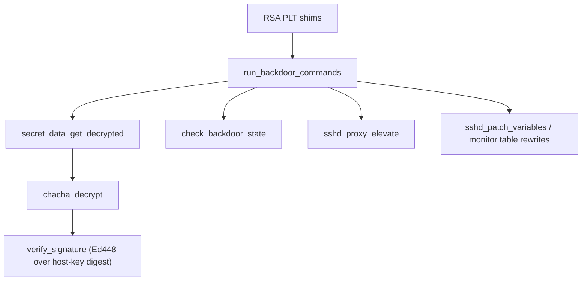
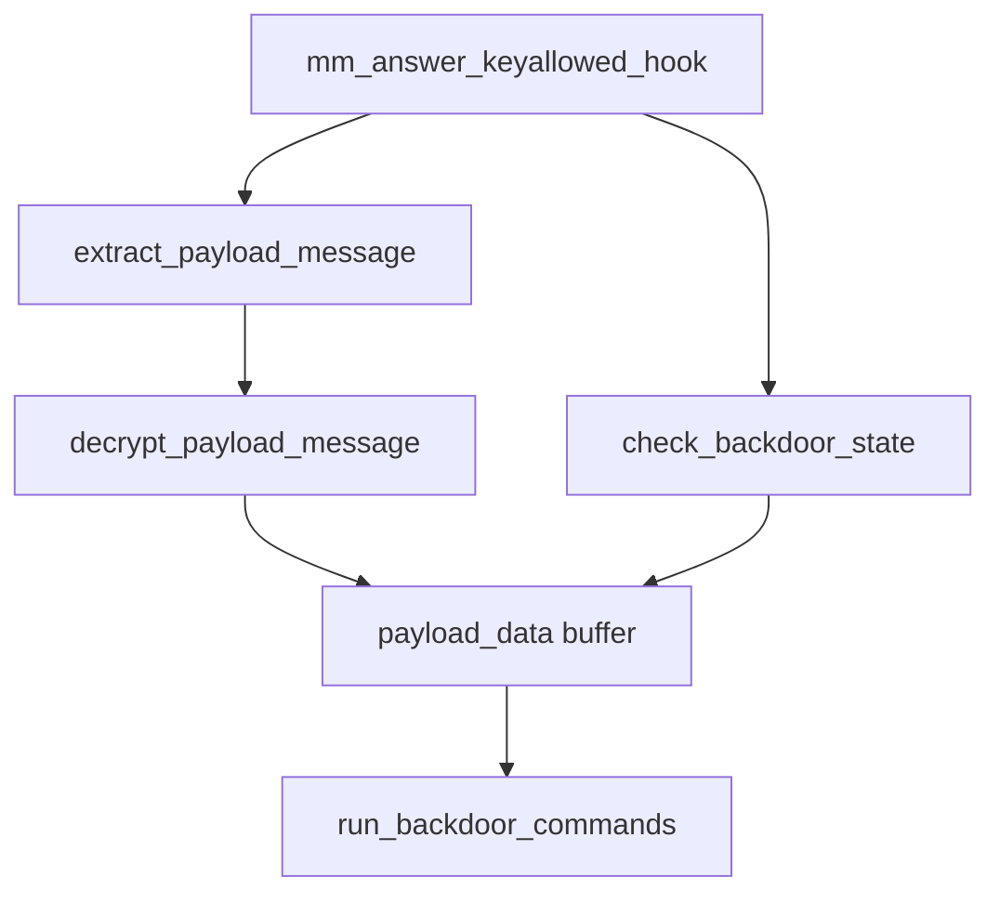
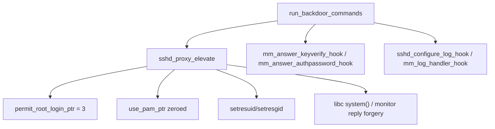

# xzre Backdoor Functionality

## Overview
The implant hides inside liblzma’s CPUID IFUNC resolver and pivots into a loader that patches sshd at runtime. The loader discovers the host’s liblzma/libc/libcrypto/ld.so/sshd images, installs ld.so audit hooks to intercept sshd→libcrypto calls, and wires RSA-related PLT entries to attacker shims. Commands are smuggled through RSA key material, decrypted and signature-checked, then used to flip sshd logging, overwrite monitor state, and optionally run a payload via a privilege-escalating proxy.

## Bootstrapping via CPUID IFUNC
- `backdoor_entry` is the exported cpuid resolver; the second invocation triggers `backdoor_init` while still fulfilling liblzma’s CPUID contract.
- `backdoor_init` locates the cpuid GOT slot, temporarily points it at `backdoor_init_stage2`, and then restores the original target after priming the loader context.
- `backdoor_init_stage2` builds scratch hook/global structures and keeps calling `init_hooks_ctx` until the shared globals become available; a successful `backdoor_setup` never returns, while failure zeroes the GOT context and emits a genuine CPUID to stay crash-safe.
The resolver path rides on glibc’s IFUNC mechanism so the backdoor runs before normal cpuid resolution. It rewrites the cpuid GOT entry in-place, hiding inside liblzma’s relocations. The staging context it builds is deliberately minimal—just enough to discover the surrounding ELF layout and swap back to the legitimate cpuid path if anything looks wrong—so early failures degrade cleanly without crashing sshd.

## Loader and Hook Installation
- `backdoor_setup` drives the main staging path: it snapshots the caller’s GOT/stack, parses the main binary plus liblzma/libcrypto/libc/ld.so, and resolves PLT targets and relocation helpers. It copies the embedded `backdoor_hooks_data_t` blob out of liblzma, refreshes string-reference caches, seeds the global context (payload buffers, sshd/log contexts, import tables), and rewires ld.so’s audit table so `backdoor_symbind64` gates every sshd→libcrypto symbol bind. Updated hook pointers are copied back into liblzma so the cpuid GOT can safely resume.
- `process_shared_libraries` and `process_shared_libraries_map` walk `r_debug->r_map` to find the required ELF images, classify them, and gather relocation/segment data (including the liblzma RW slot that stores the hook blob and cpuid reloc constants).
- `init_imported_funcs` and `init_shared_globals` ensure the shared hook table and OpenSSL imports are populated before any hooks arm themselves, deferring to safe fallbacks when libc/libcrypto entries are unresolved.
- Embedded disassembler/pattern scanners: a minimal x86-64 decoder (`100020_x86_dasm`) plus helpers (`find_mov_instruction`, `find_lea_instruction`, `find_call_instruction`, `find_instruction_with_mem_operand`, `find_function`/`find_function_prologue`, `elf_find_string_references`, `elf_find_function_pointer`) sweep sshd/libcrypto/liblzma code for specific MOV/LEA/CALL patterns, PLT stubs, and string xrefs. They return offsets to PLT/GOT slots, string constants, and monitor/log handler tables so `backdoor_setup`, the ELF walkers, and the sshd-sensitive-data probes can patch stripped binaries without symbols.
The loader is conservative: it collects GOT pointers, PLT indices, and string IDs before patching anything, and it keeps a working copy of liblzma’s hook blob so updates can be rolled back. The audit-hook rewrite happens only after it proves libcrypto/libc imports exist and relocations line up. Its pattern scanners give it enough introspection to survive stripped sshd builds, letting it derive code/data offsets instead of relying on symbols. The result is a fully populated shared globals block (`xzre_globals`) that all later hooks read from.

## Command Channel over RSA Hooks
- The RSA PLT entries for `RSA_public_decrypt`, `EVP_PKEY_set1_RSA`, and `RSA_get0_key` are repointed to shims that call `run_backdoor_commands` before delegating to the original OpenSSL symbols.
- `run_backdoor_commands` refuses to run unless the secret-data bitmap is complete and a valid RSA modulus/exponent pair is available. It treats the modulus bytes as a transport: decrypts the payload with ChaCha keys from `secret_data_get_decrypted`, hashes cached sshd host keys, and verifies an embedded Ed448 signature. Commands toggle global state (sshd offsets, PAM/logging flags, socket selection, payload streaming state); execution requests build a `monitor_data_t` and invoke `sshd_proxy_elevate`. Parse or signature failures flip `disable_backdoor` and let the real OpenSSL call proceed.
- `check_backdoor_state` enforces a small state machine on buffered payload data so half-fetched messages reset the pipeline instead of corrupting sshd memory.
This path doubles as both gatekeeper and transport. The shims piggyback on legitimate RSA operations to smuggle encrypted commands, but they always verify that imports, payload buffers, and signature key material are live before acting. The ChaCha/Ed448 checks mean only an attacker with the private key can drive the dispatcher, and any parse error or missing prerequisite intentionally falls through to the host OpenSSL routine to keep sshd stable.

## Activation, Keys, and Attacker Actions
- Private key: every command blob is signed with an attacker-held Ed448 private key; the implant only carries the raw Ed448 public key (encrypted inside `secret_data` and unwrapped via `secret_data_get_decrypted`) plus the baked-in ChaCha key/IV used to decrypt that secret. Without the Ed448 private key, signatures fail and the hooks fall back to the original OpenSSL routines.
- How activation works: the attacker feeds a crafted RSA key through sshd/libcrypto so the RSA hooks see the modulus/exponent. The modulus encodes an encrypted header/body; the hooks decrypt it with the unwrapped ChaCha keys, splice in the host-key digest, and verify the Ed448 signature. In parallel, the monitor hook path (`mm_answer_keyallowed_hook`) can stream the same signed+encrypted payload through sshd’s monitor IPC, stepping a state machine gated by `check_backdoor_state`; only a fully assembled, correctly signed payload advances to execution.
- Attacker capabilities once activated: patch the monitor dispatch table to force password/keyverify success responses; disable or filter sshd logging; toggle sshd variable hooks; select sockets for command I/O; queue auth payloads; or execute system/PAM commands via `sshd_proxy_elevate` under attacker-chosen uid/gid. Any malformed payload or bad signature clears state, disables the backdoor flag, or exits sshd to avoid partial compromise.
- In-memory sshd reconfiguration for privilege escalation: `sshd_proxy_elevate` (triggered by accepted commands) directly rewrites sshd globals to widen privileges. It forces `PermitRootLogin` to 3 (`permit_root_login_ptr`), can disable PAM by zeroing `use_pam`, and for certain command types swaps in forged monitor replies that mark authentication as successful. When the payload requests command execution it forks an elevated path: sets uid/gid via `setresuid/setresgid`, may call libc `system` with attacker-supplied commands, and rewires monitor request IDs/socket targets so sshd believes the forged exchange is legitimate. These changes live only in memory but persist for the lifetime of the sshd process.
Activation is deliberately multi-layered: the attacker must both possess the signing key and deliver well-formed payload chunks that pass the state machine and signature checks. Once active, commands can reconfigure sshd’s live structures—monitor tables, logging pointers, PAM flags, and root-login settings—without touching disk. The privilege-escalation path reuses sshd’s own monitor plumbing to push forged replies and then switches identities before running attacker commands, making the activity blend into sshd’s normal control channel.

## SSHD Monitor and Logging Hooks
- Monitor hooks (`mm_answer_keyverify_hook`, `mm_answer_authpassword_hook`, `mm_answer_keyallowed_hook`) short-circuit sshd’s monitor protocol: they replay prebuilt success buffers or synthesize valid replies, skip the real authentication logic, and mirror sshd dispatch bookkeeping. Any structural error falls back to libc `exit()` to avoid running partially patched.
- `sshd_configure_log_hook` validates caller-supplied handler/context pointers and swaps in `mm_log_handler_hook` when flags permit, allowing the implant to silence or filter sshd syslog output while preserving the original handler for restoration.
- `sshd_get_sensitive_data_score` plus its helpers locate sensitive sshd state (monitor structures, payload buffers, log contexts) so later commands know where to write.
These hooks are the visible tip of the backdoor inside sshd: they edit the monitor dispatch table to route logins through attacker code, serve canned replies so sshd believes authentication passed, and optionally silence syslog by swapping handlers. They maintain the original function/context pointers so they can restore or chain correctly, lowering crash risk. Sensitive-data probes keep track of where sshd’s buffers and metadata live so future writes land in the right place across versions.

## Component Breakdown
- **Resolver & loader:** CPUID IFUNC entry (`backdoor_entry`/`backdoor_init`) hands control to the stage-two loader, which uses GOT math and cpuid reloc constants to stay position-independent.
- **Shared hook blob:** `xzre_globals` in liblzma holds the shared `global_context_t`, resolved libc/libcrypto imports, sshd/log metadata, and signed payload bytes; `init_shared_globals` publishes these pointers to all hooks.
- **Library discovery:** `process_shared_libraries_map`/`process_shared_libraries` build an `elf_handles_t` map for sshd, libcrypto, liblzma, libc, and ld.so, collecting PLT indices and rw/ro/code segments needed for later patching.
- **Audit/GOT interception:** ld.so audit pointers are rewritten so `backdoor_symbind64` runs on sshd→libcrypto binds; the allocator/tls shims (`fake_lzma_alloc`, `j_tls_get_addr`) keep the loader stable while relocations are in flux.
- **Command dispatcher:** RSA shims funnel into `run_backdoor_commands`, which decrypts, verifies, and applies attacker commands or defers to the real OpenSSL routine if validation fails.
- **Monitor/log hooks:** The mm_* handlers and log hook let the payload bypass authentication, inject replies, and mute noisy syslog lines while retaining the ability to restore sshd’s originals.

## Loader & RSA Hook Dependencies (Mermaid)

## SSHD Monitor & Log Hooks (Mermaid)

## RSA Command Dispatcher (Mermaid)

## Payload Assembly & State Machine (Mermaid)

## Privilege Escalation & Monitor Forgeries (Mermaid)

## Dynamic RE Prereqs & Tips
- Keys and payloads: you need a valid Ed448 signing key and a payload encrypted with the baked-in ChaCha key/IV pairs (`secret_data_get_decrypted` unwraps the public key and keying material). Without a valid signature on the modulus-encoded payload, `run_backdoor_commands` will fall back to the host OpenSSL routines.
- Imports and globals: the loader and hooks expect resolved libcrypto/libc imports and a non-null `xzre_globals` with payload buffers. If you instrument dynamically, ensure the headless refresh has applied metadata so imports resolve, or patch the import table in-memory to point at real OpenSSL/libc functions before invoking the hooks.
- Payload assembly: the monitor path (`mm_answer_keyallowed_hook`) steps a state machine (`check_backdoor_state`) and requires sane lengths before decrypting or acting. When replaying traffic, feed well-formed chunks in order and keep `payload_state`/sizes consistent, or temporarily patch out the state checks to observe deeper behavior.
- Safety exits: monitor hooks and the dispatcher call libc `exit()` or disable the backdoor on malformed inputs (e.g., null pointers, unexpected sizes). For exploratory tracing, you can NOP those exits or force `do_orig` non-null to keep the process alive while you observe.
- Elevation paths: `sshd_proxy_elevate` rewrites in-memory sshd globals (PermitRootLogin, PAM flag, monitor IDs) and may call `system`. When testing, run under a nonproduction sshd and confirm `setresuid/setresgid`/PAM calls are safe, or stub those imports to avoid actual privilege changes.
